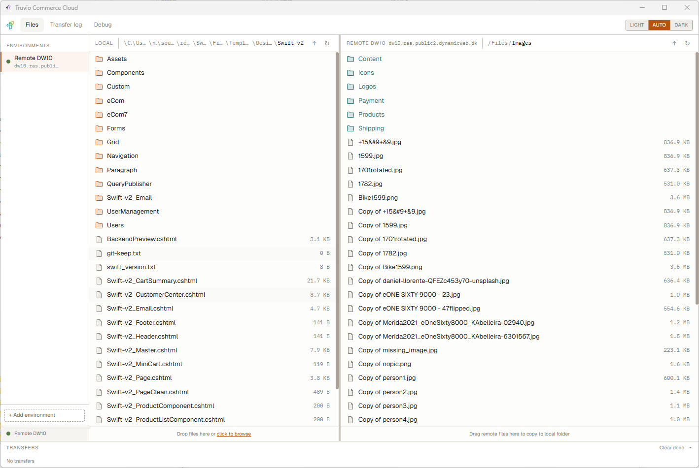
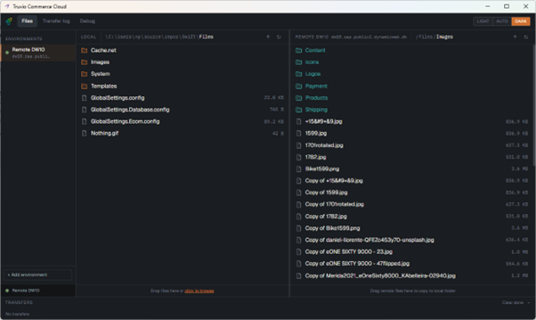

# Truvio Commerce Cloud Desktop

A cross-platform desktop application for managing [Dynamicweb 10](https://www.dynamicweb.com) solutions — file transfers, environment management, and remote file browsing, all without needing a terminal.




---

## Download

Get the latest version from the [Releases page](https://github.com/dynamicweb/dw-desktop/releases/latest).

| Platform | Download |
|---|---|
| **Windows** (x64 — most PCs) | `dw-desktop-*-x64-setup.exe` |
| **Windows** (ARM64 — Snapdragon / Surface Pro X) | `dw-desktop-*-arm64-setup.exe` |
| **macOS** (Universal — Intel + Apple Silicon) | `dw-desktop-*.dmg` |
| **Linux** | `.AppImage` or `.deb` |

> **macOS note:** The app is not yet notarized with Apple. On first launch, right-click the app and choose **Open** to bypass the Gatekeeper warning.

---

## What you can do

- Move files between your local machine and DW10 environments
- Browse and manage remote files visually
- Work across multiple environments (dev, staging, production)
- Handle large transfers with progress tracking and logs


## Key features

- **Dual-pane file browser**  
  Local files on one side, remote environment on the other

- **Drag & drop transfers**  
  Upload and download files with real-time progress

- **Batch operations**  
  Move entire folders or multiple files in one go

- **Remote file management**  
  Rename, delete, and copy files directly in the environment

- **Multiple environments**  
  Switch instantly between your DW10 setups

- **Flexible authentication**  
  API key, OAuth, or username/password

- **Transfer history**  
  Full log of everything that moved — useful for debugging and traceability

- **Cross-platform**  
  Runs on Windows, macOS, and Linux

- **Theme support**  
  Light, dark, or follow your OS


## When to use it

DW Desktop is ideal when you need to:

- Deploy files to a staging or production environment
- Pull files down for debugging or local development
- Quickly inspect or fix something directly on a remote instance
- Work across multiple environments without juggling credentials or tools

## Getting started

### 1. Download and install

Download the app from the [Releases page](https://github.com/dynamicweb/dw-desktop/releases/latest) and install it.

### 2. Add an environment

Click **+ Add environment** in the sidebar, then fill in:

- **Name** — a label for the environment (e.g. "My solution staging")
- **Host** — the URL of your DW10 solution (e.g. `https://mysite.example.com`)
- **Local start folder** *(optional)* — a default local folder to open for this environment

### 3. Choose an authentication method

Click **Next** to reach the Authentication step. Three methods are available:

#### OAuth (recommended for most setups)

Uses the OAuth 2.0 Client Credentials flow — no user password stored, tokens are short-lived.

**When to use:** Preferred for all interactive use. More secure than API keys and easier to revoke.

**How to set up in DW10:**
1. Go to **Settings → System → Developer → OAuth Clients**
2. Click **Add client**
3. Set **Grant type** to **Client credentials**
4. Copy the generated **Client ID** and **Client secret** into the app

> Full guide: [OAuth Clients — Dynamicweb docs](https://doc.dynamicweb.dev/manual/dynamicweb10/settings/system/developer/oauth.html)

#### API key

A static token tied to a specific DW10 user account.

**When to use:** When OAuth is not available on your solution version, or for quick testing. Less flexible than OAuth — the key stays valid until manually deleted.

**How to set up in DW10:**
1. Go to **Settings → System → Developer → API Keys**
2. Click **Add API key**
3. Assign it to a user with sufficient file permissions
4. Copy the key into the app

> Full guide: [API Keys — Dynamicweb docs](https://doc.dynamicweb.dev/manual/dynamicweb10/settings/system/developer/api-keys.html)

#### Username & password

Authenticates directly with a DW10 backend user account.

**When to use:** As a fallback when neither OAuth nor API keys are available. Not recommended for shared or long-running setups.


## Contributing

Contributions are welcome. The app is built with Electron + Vite + React + TypeScript.

### Prerequisites

- [Node.js](https://nodejs.org/) 18 or later
- npm (comes with Node.js)

### Clone and install

```bash
git clone https://github.com/dynamicweb/dw-desktop.git
cd dw-desktop
npm install
```

### Run in development

```bash
npm run dev
```

This starts the Electron app with hot-reload for the renderer process.

### Type checking

```bash
npm run typecheck
```

### Build a distributable

```bash
# Windows
npm run build:win

# macOS
npm run build:mac

# Linux
npm run build:linux
```

### Linux runtime dependencies

If the app fails to launch on Linux with a shared-library error, install the missing system packages:

**Ubuntu 24.04+**
```bash
sudo apt install -y libnspr4 libnss3 libasound2t64 libsecret-1-0
```

**Older Ubuntu / Debian**
```bash
sudo apt install -y libnspr4 libnss3 libasound2 libsecret-1-0
```

### Tech stack

| Layer | Technology |
|||
| Shell | Electron |
| Bundler | electron-vite |
| UI | React 19 + TypeScript |
| Styling | Tailwind CSS v4 |
| State | Zustand |
| Credential storage | keytar |

### IDE setup

[VSCode](https://code.visualstudio.com/) with the [ESLint](https://marketplace.visualstudio.com/items?itemName=dbaeumer.vscode-eslint) and [Prettier](https://marketplace.visualstudio.com/items?itemName=esbenp.prettier-vscode) extensions is recommended.
